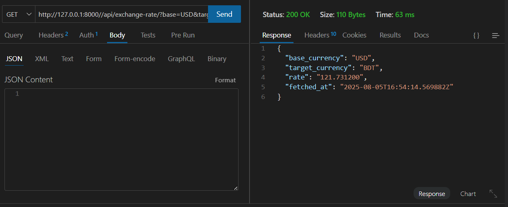

# Subscription Management System with Currency Exchange Tracker

A Django-based system for managing subscriptions with real-time currency exchange tracking.

## Features
- ✅ User subscription management  
- 💰 Plan management  
- 🌍 Currency exchange rate tracking  
- ⏰ Background tasks with Celery  
- 🔒 JWT Authentication  
- 📊 Admin dashboard
  
## API Documentation
# Authentication


# /api/subscribe/


# /api/subscriptions/


# /api/cancel/


# api/exchange-rate/?base=USD&target=BDT


## Frontend
# /subscriptions/


## Ubuntu/WSL Setup

## Installation
```bash
# Clone repository
git clone https://github.com/shakilahmedraju/Subscription-Management-System.git
cd SubXTracker

# Set up virtual environment
python -m venv venv
source venv/bin/activate

# Install dependencies
pip install -r requirements.txt

# Install dependencies
python manage.py migrate
python manage.py createsuperuser

# Redis Server
sudo service redis-server start

# Celery Run
celery -A config worker --loglevel=info

# Django Server
python manage.py runserver

